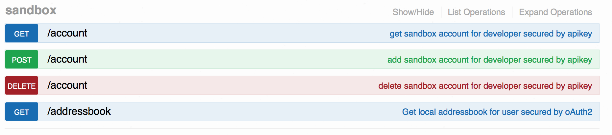
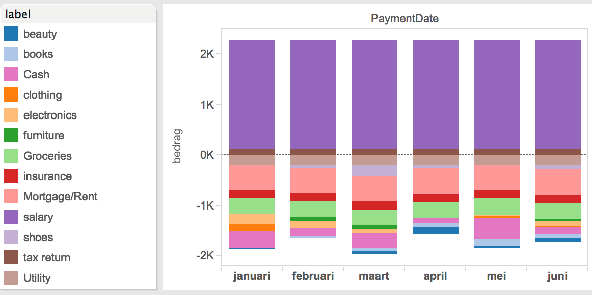
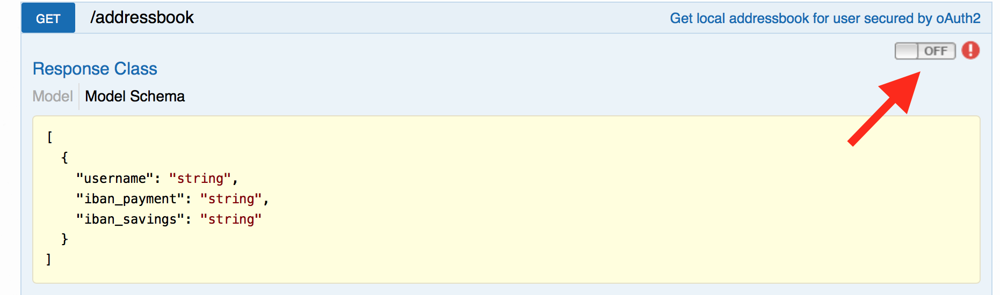
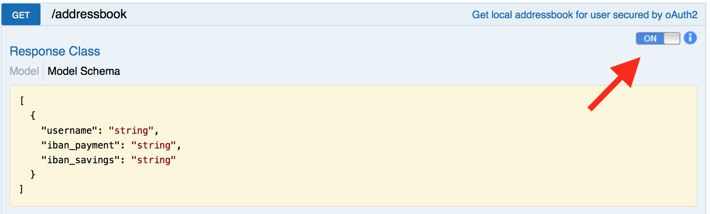

# Getting started with the honeybee environment

# Contents
- [Creating an application](#creating-an-application)
- [Generating sandbox users](#generating-sandbox-users)
- [Inviting your developers](#Inviting-your-developers)
- [Using API keys in the documentation portal](#Using-api-keys-in-the-documentation-portal)
- [Using oAuth2 in the documentation portal](#using-oauth2-in-the-documentation-portal)
- [Using oAuth2 outside the documentation portal](#using-oauth2-outside-the-documentation-portal)
- [Creating transactions](#creating-transactions)
- [Sample application](#sample-application)

#Creating an application
The first thing you should do after logging into the environment is create an application. You can create multiple applications, but you probably are building one app for the hackaton. An application holds the keys needed to call APIs.


Be sure to give your application a clear name, because this name will be provided on the user consent screen.

The next screen will contain some details. Please read the annotations


After the application is created you can still see the client id (API key) in the Applications view :


There is no need to attach APIs to a specific application. All APIs can be used to a maximum of 10.000 call's per day. If you need more, please contact the team.

#Generating sandbox users

Within the platform you are able to create users (customers) with accounts and a generated transaction history. Easiest way to do this is through the documentation page. Here you will find the sandbox services (be sure to login before using these services) :



- GET/account  
Will return all the created accounts you have created (maximum of 3)
- POST/account  
Will create a new account, and return the new credentials (login, password and tincode) to a maximum of three accounts.
- DELETE/account  
For removing an account based on username (user = username)
- GET/addressbook  
Will return an addressbook of all sandbox users. This can be used to identify accounts where you can exchange payments.

When creating transactions, the sending account and beneficiary account will be debited/credited only when those accounts belong to the same sandbox. Otherwise only the sending account will be debited. It is not possible to create transactions to other sandboxes (which are tied to an API-key).

For every account that is created the platform will generate a transaction history. This history will be antedated from the current date to 6 months in the past. Every transaction line is labeled. To give you an idea on this labels, and the monthly spending in a generated account :




#Inviting your developers
following screenshot depicts the step you should take to invite co-developers. Be sure that you first login to the environment with your credentials.


The invite is send to the email address provided.

#Using API keys in the documentation portal

You cab use multiple applications, but mostly you will require just one. In the case of multiple applications you can switch api-keys from the dropdown at the top of the documentation page. Be aware that sandbox users are tied to an application, and therefore to a specific api-key.


#Using oAuth2 in the documentation portal

Most of the banking apis require you to login through oAuth2. Within the documentation page you can authenticate yourself (your user account) with the oAuth2 switch :



When pushing this switch you will be asked for a scope. In this platform we only use one scope ('all'). After selecting the scope you will be directed to the login and consent page. The login credentials are provided through the sandbox rest service - GET/account. Be sure to note them down, or switch pages to enter the username and paasword on the login screen.
After a succesfull login you will return to the documentation page, and the switch should be turned on :



Every rest service you test after logging in will use the token provided for the user you used to sign in.

#Using oAuth2 outside the documentation portal

The authorization url for the oAuth implementation is :
```
http://hackaton.eu-gb.mybluemix.net/dialog/authorize
```
The token access url is :
```
http://hackaton.eu-gb.mybluemix.net/oauth/token
```

It is possible to use the implicit, or code authorization grant type for getting a token.

An example cordova application is posted on github for using oAuth2 in a mobile app:
```
https://github.com/honeybeeAPI/BalanceSample
```
Please read the README for setting up this example.
although not extensive, this should provide you with enough information on setting up your own app.

#Creating transactions

#Sample application
BalanceSample is a cordova based example application for implementing a login sequence and getting a current account balance.

prerequisites :
apache cordova
https://cordova.apache.org/docs/en/4.0.0/guide_cli_index.md.html

clone this application and cd into the cloned directory
```
git clone https://github.com/honeybeeAPI/BalanceSample.git
cd BalanceSample
```

Add your platform with the following command :

```
cordova platform add ios
```
or
```
cordova platform add android
```

Install the needed inappbrowser plugin :

```
cordova plugin add org.apache.cordova.inappbrowser
```

And the whitelist plugin :

```
cordova plugin add cordova-plugin-whitelist
```

Important!  
copy www/js/apiclient-placeholder.js to www/js/apiclient.js
Fill in the clientId and clientSecret variables in the www/js/apiclient.js file with your API application credentials

Run or emulate the application with :

```
cordova run ios
```
or
```
cordova run android
```


If you are experiencing an authorization error, you probably forgot to fill in the right App credentials in the apiclient.js file.
