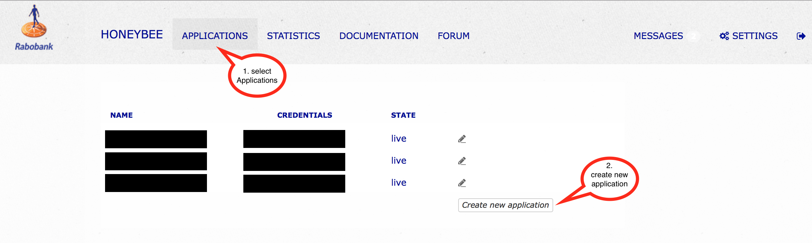
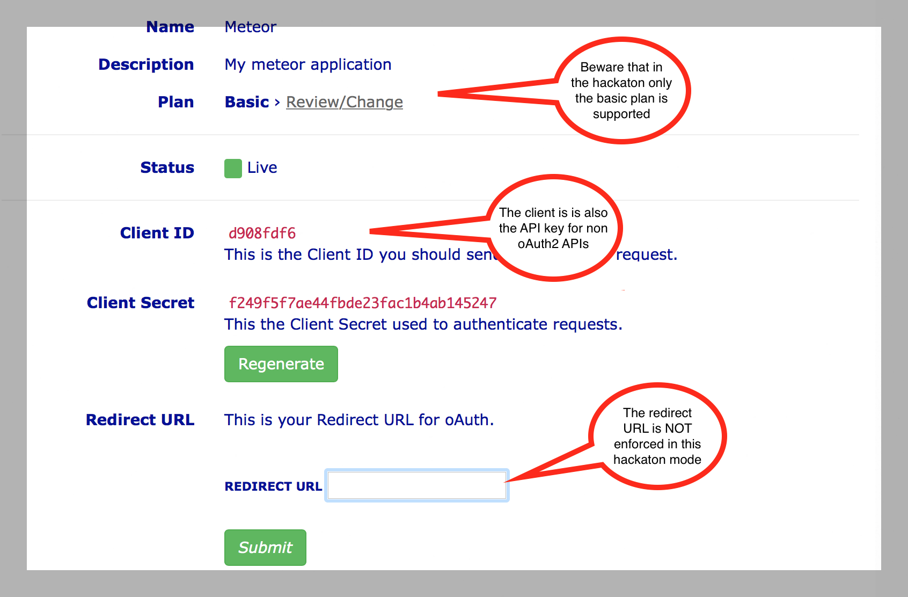
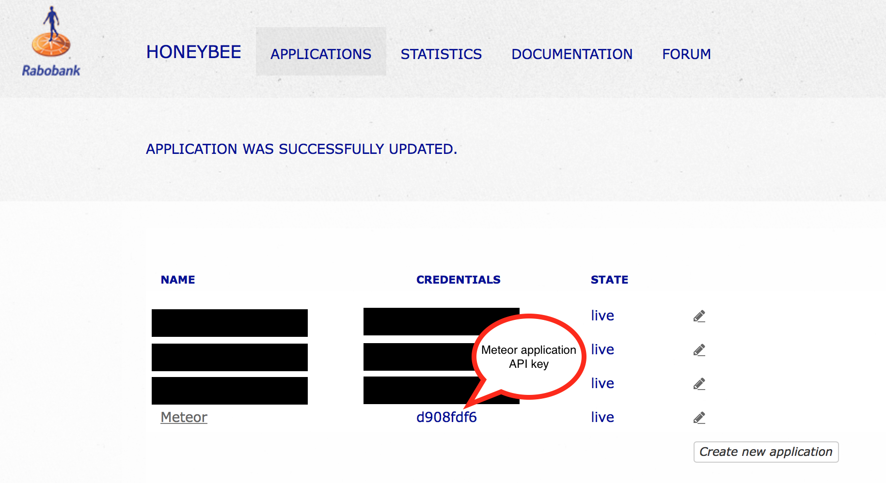
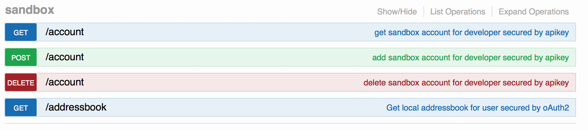
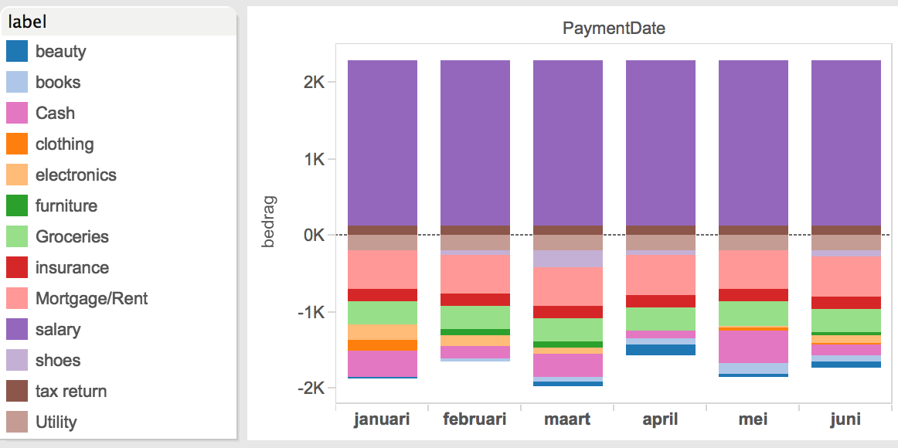
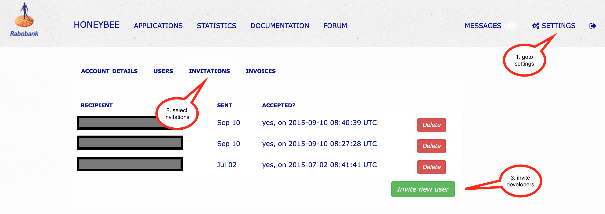
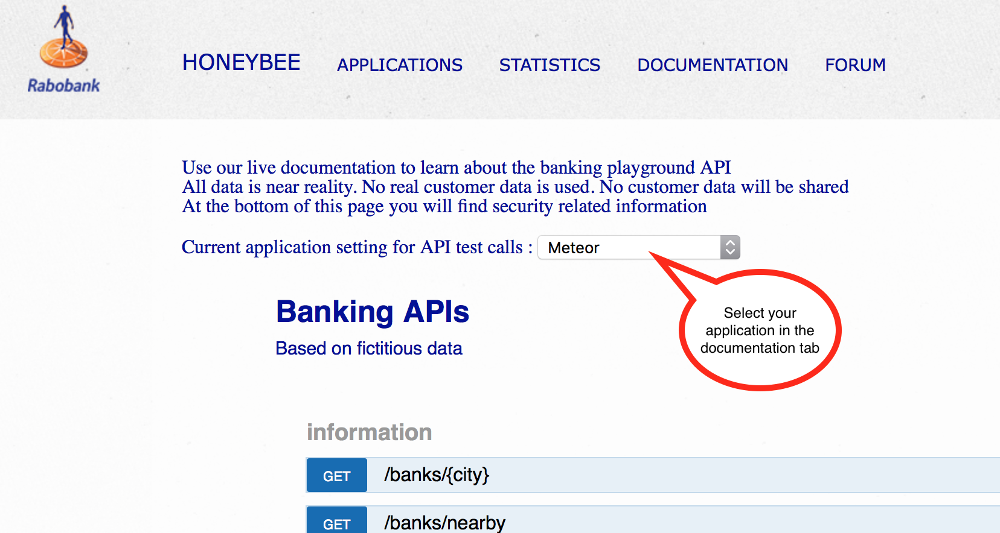

# Getting started with the honeybee environment

# Contents
- [Creating an application](#creating-an-application)
- [Generating sandbox users](#generating-sandbox-users)
- [Inviting co-developers](#Inviting-co-developers)
- [Using API keys in the documentation portal](#Using-API-keys-in-the-documentation-portal)
- [Using oAuth2 in the documentation portal](#using-oauth2-in-the-documentation-portal)
- [Creating transactions](#creating-transactions)

#Creating an application
The first thing you should do after logging into the environment is create an application. You can create multiple applications, but you probably are building one app for the hackaton. An application holds the keys needed to call APIs.

Be sure to give your application a clear name, because this name will be provided on the user consent screen.

The next screen will contain some details. Please read the annotations

After the application is created you can still see the client id (API key) in the Applications view :

There is no need to attach APIs to a specific application. All APIs can be used to a maximum of 10.000 call's per day. If you need more, please contact the team.

#Generating sandbox users

Within the platform you are able to create users (customers) with accounts and a generated transaction history. Easiest way to do this is through the documentation page. Here you will find the sandbox services :

- GET/account  
Will return all the created accounts you have created (maximum of 3)
- POST/account  
Will create a new account, and return the new credentials (login, password and tincode) to a maximum of three accounts.
- DELETE/account  
For removing an account based on username (user = username)
- GET/addressbook  
Will return an addressbook of all sandbox users. This can be used to identify accounts where you can exchange payments.

When creating transactions, the sending account and beneficiary account will be debited/credited only when those accounts belong to the same sandbox. Otherwise only the sending account will be debited. It is not possible to create transactions to other sandboxes (which are tied to an API-key).

For every account that is created the platform will generate a transaction history. This history will be antedated from the current date to 6 months in the past. Every transaction line is labeled. To give you an idea on this labels, and the monthly spending in a generated account :

#Inviting co-developers
following screenshot depicts the step you should take to invite co-developers. Be sure that you first login to the environment with your credentials.

The invite is send to the email address provided.

#Using API keys in the documentation portal

#Using oAuth2 in the documentation portal

#Creating transactions
